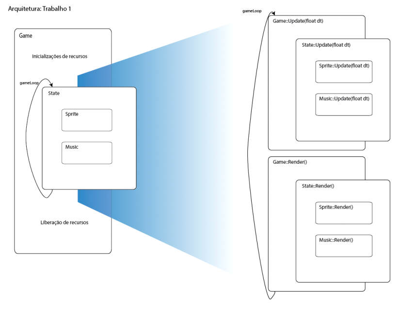

# Unnamed Game

## Projeto em C++ usando SDL

Tópicos Avançados em Computadores, Turma JE. Professora Carla Castanho.

**Trabalho 1 – Game Loop, Sprite e Music**

Esse trabalho consiste no começo da implementação da engine que vai rodar o jogo. A arquitetura montada pode ser visualizada na imagem:

Para compilar dê `make` no terminal.

Agora, para executar o jogo digite o comando `./build/game`.